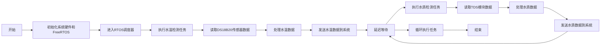

# 校园饮水机客户端

## 项目介绍

-   实时监控直饮水设备的状态和水质，水质采用TDS指标进行监测。在检测到水质异常或设备故障时，系统应当自动触发报警机制，确保紧急问题的及时处理；
-   饮水设备应支持与后台服务器的实时通信，设备需要实时传输数据至服务器，包括设备ID、学生卡号、饮水时间、饮水量、设备故障和警告信息，以进行监管和数据记录。

## 硬件实现

### IO分配

1.   USART

| 串口  | TX 引脚 | RX 引脚 | 波特率 | 用途                                |
| ----- | ------- | ------- | ------ | :---------------------------------- |
| 串口1 | PA9     | PA10    | 115200 | ESP8266 连接 WiFi 与 TCP服务器 通讯 |
| 串口2 | PA2     | PA3     | 115200 | LoRa 与巡检设备进行无线通讯         |
| 串口3 | PB10    | PB11    | 115200 | 单片机与串口屏的通讯                |

2.   SPI

RC522与stm32进行SPI通讯，本次使用SPI2管脚如下：

| 引脚 | 功能          | 端口 |
| ---- | ------------- | ---- |
| SCK  | 时钟          | PB13 |
| MISO | 主输入/从输出 | PC2  |
| MOSI | 主输出/从输入 | PC3  |
| SDA  | 串行数据线    | PB8  |
| RST  | 复位          | PB9  |

3.   ADC

| 引脚 | 功能       | 端口 |
| ---- | ---------- | ---- |
| TDS  | ADC1 通道1 | PA1  |

4.   TIM

| 引脚 | 功能       | 端口 |
| ---- | ---------- | ---- |
| TIM2 | 测量脉冲数 | PA5  |

5.Other

| 引脚    | 功能             | 端口 |
| ------- | ---------------- | ---- |
| DS18B20 | 数据引脚         | PE2  |
| 继电器  | 控制继电器的引脚 | PE3  |

## 初始化

-   DS18B20温感初始化

-   TDS水质检测初始化

-   RFID射频检测初始化

-   ESP8266网络通讯初始化

-   LoRa无线通讯初始化

    

